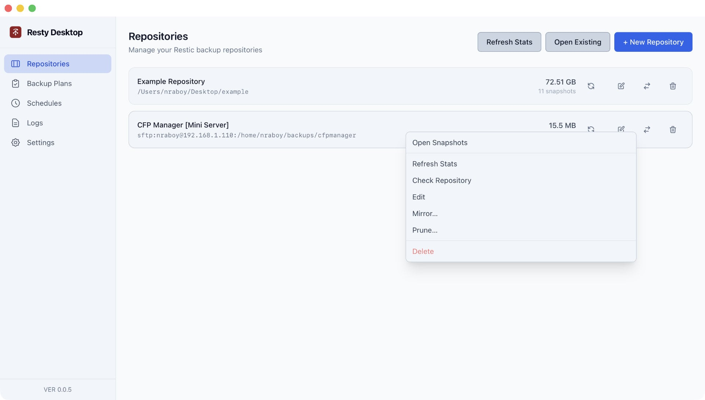
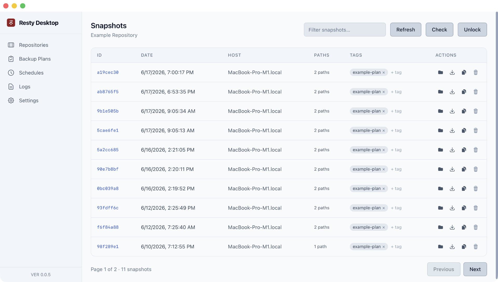
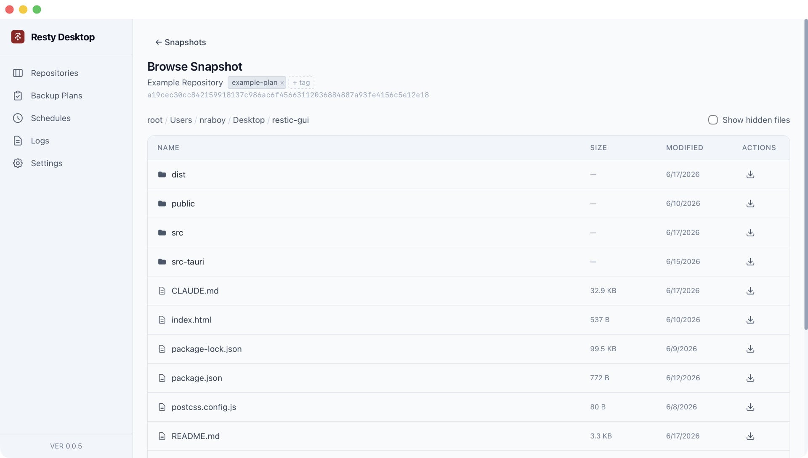
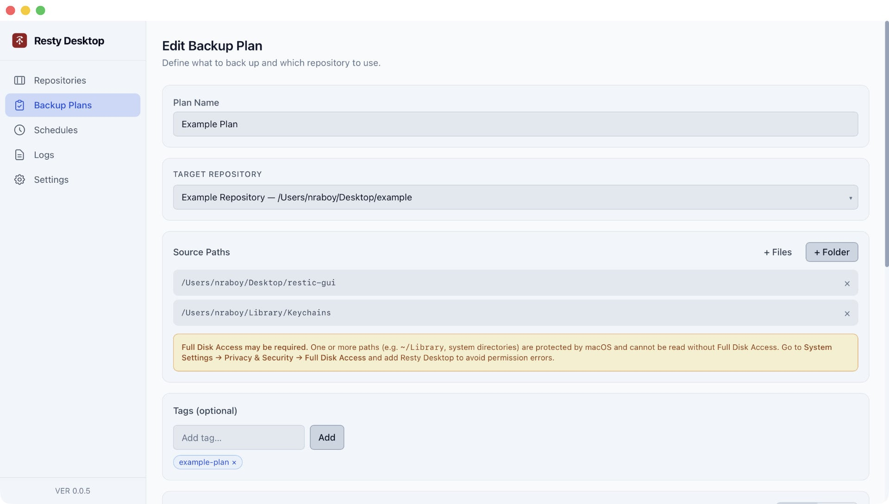
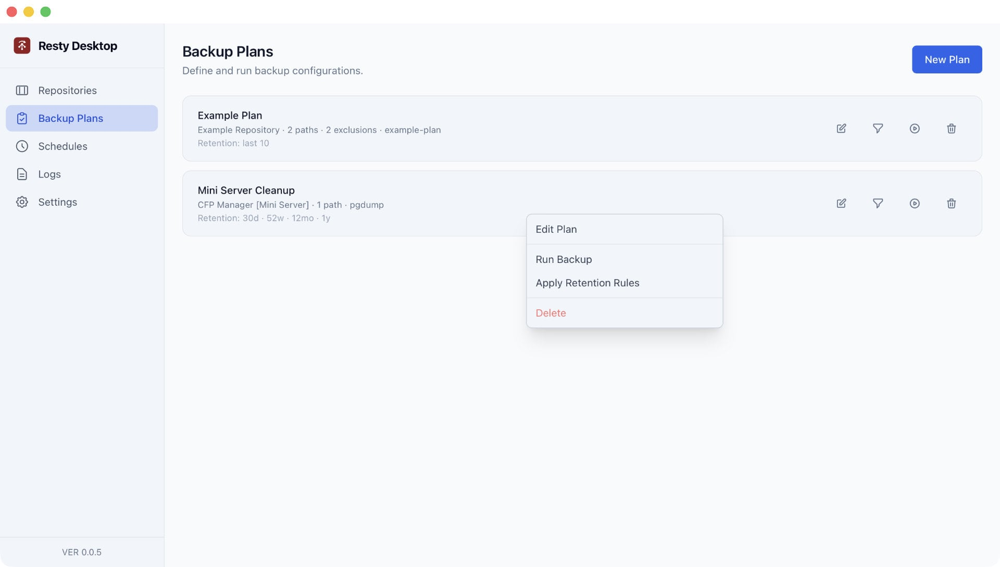
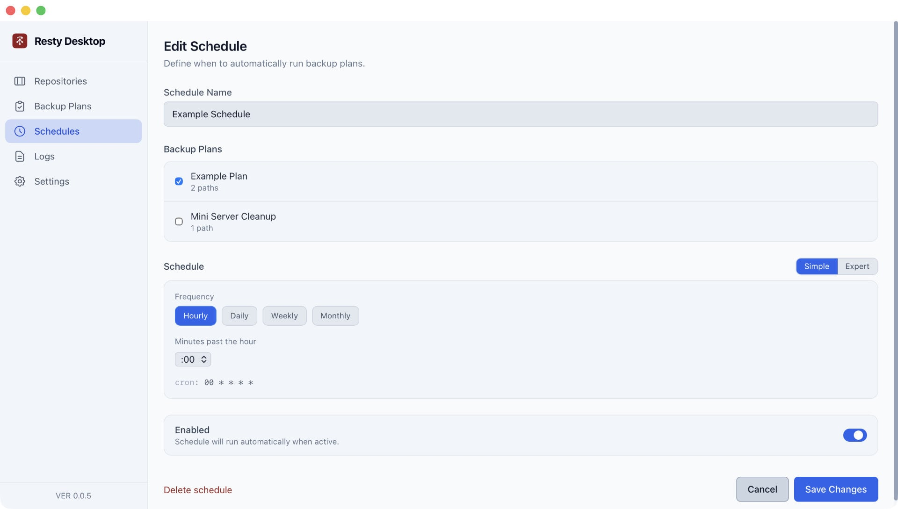
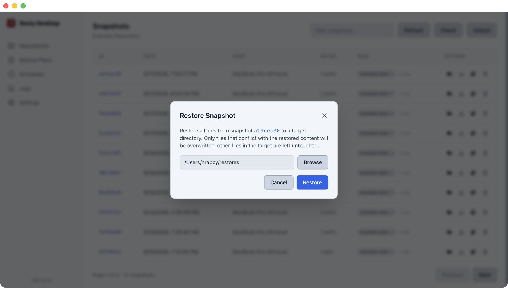
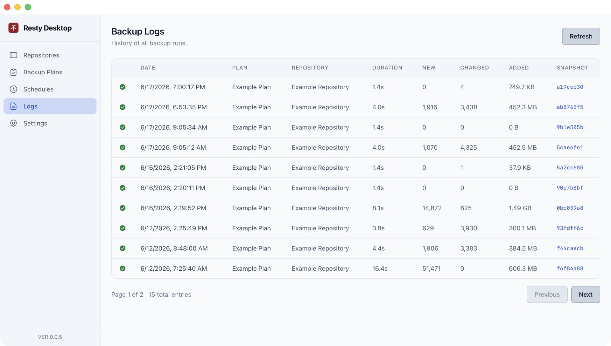
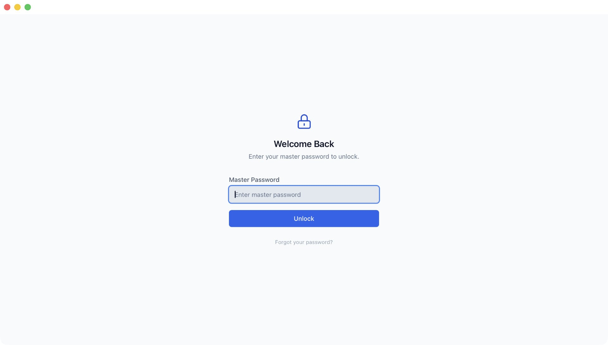

# Resty Desktop

A cross-platform desktop client for [Restic](https://restic.net/), the fast and secure backup tool. Resty Desktop wraps the Restic CLI to provide a visual interface for managing repositories, creating backups, browsing snapshots, and restoring files — without touching the command line.

## Screenshots

| | | |
|:---:|:---:|:---:|
|  |  |  |
| List Repositories | List Snapshots | Browse Files within Snapshots |
|  |  |  |
| Define Backup Plans | List Backup Plans | Schedule Backups |
|  |  |  |
| Restore Snapshot | Backup History | Unlock Application |

## Features

- **Master password** — all repository passwords are encrypted at rest; a single master password unlocks the app on each launch
- **Repository management** — add local or remote repositories (S3, SFTP, B2, etc.), initialize new ones, check integrity, rename, remove, or mirror to another repo
- **Backups** — define backup plans with source paths, tags, exclude patterns, and retention policies; run plans on demand or on a schedule
- **Schedules** — attach backup plans to a cron schedule; runs happen in the background even while the UI is closed
- **Snapshots** — browse all snapshots in a repository, add or remove tags, and delete with optional pruning
- **Snapshot diff** — compare any two snapshots to see exactly what was added, removed, or modified, with per-entry restore directly from the diff view
- **File browser** — navigate the file tree inside any snapshot and restore individual files, directories, or entire snapshots
- **Bandwidth limits** — optionally throttle upload and download speeds per backup plan for remote repositories
- **System tray** — optionally minimize to the system tray so scheduled backups continue running while the window is closed
- **Themes** — dark, light, and system appearance modes
- **Logs** — persistent history of every backup run with duration, file counts, bytes added, and snapshot ID

## Download

Pre-built binaries for macOS, Windows, and Linux are available on the [GitHub Releases page](https://github.com/nraboy/resty-desktop/releases).

## Requirements

- [Restic](https://restic.readthedocs.io/en/latest/020_installation.html) 0.17 or newer, installed and available on `$PATH` (or configured via Settings)
- [Rust](https://rustup.rs/) (for building from source)
- Node.js 18+

## Getting Started

Install Rust if you haven't already:

```bash
curl --proto '=https' --tlsv1.2 -sSf https://sh.rustup.rs | sh
```

### Linux Prerequisites

Tauri v2 requires WebKitGTK and a few other system libraries on Linux. Install them before running `npm run tauri dev` or `npm run tauri build`.

**Debian / Ubuntu:**

```bash
sudo apt update
sudo apt install libwebkit2gtk-4.1-dev libssl-dev libappindicator3-dev librsvg2-dev libxdo-dev
```

**Fedora:**

```bash
sudo dnf install webkit2gtk4.1-devel openssl-devel libappindicator-gtk3-devel librsvg2-devel libxdo-devel
```

**Arch Linux:**

```bash
sudo pacman -S webkit2gtk-4.1 openssl libappindicator-gtk3 librsvg xdotool
```

Then install dependencies and start the development build:

```bash
npm install
npm run tauri dev
```

## Building a Distributable

```bash
npm run tauri build
```

The packaged app will be written to `src-tauri/target/release/bundle/`.

## Stack

| Layer | Choice |
|---|---|
| Desktop shell | Tauri v2 |
| Frontend | React 19 + TypeScript |
| Styling | Tailwind CSS v3 |
| Build tool | Vite |
| Routing | React Router v6 |
| Rust backend | Tauri v2 `#[tauri::command]` |
| Settings persistence | SQLite (`app_data.db`) — repos, plans, schedules, encrypted passwords |
| Restic integration | `std::process::Command` with `--json` flag |

## Configuration

The Restic binary path defaults to `restic` on `$PATH`. You can override it in the Settings page if Restic is installed elsewhere.

## Support the Developer

This GUI wrapper for Restic was created by [Nic Raboy](https://www.nraboy.com). If you found it valuable, consider donating to demonstrate your appreciation.

- [PayPal](https://paypal.me/nraboy)
- [Square Cash](https://cash.app/$nraboy)

## Special Note

AI was used in the development of this application. Resty Desktop is a GUI wrapper to the already existing and battle-tested Restic backup application. None of the heavy lifting happens in Resty Desktop, so AI or not, your data should be fine unless the underlying Restic application is faulty.